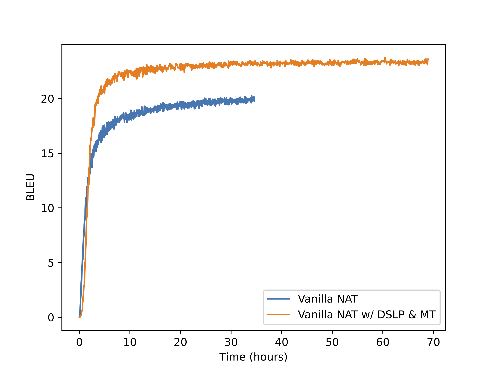

This repo contains the implementation of our paper:

Non-Autoregressive Translation with Layer-Wise Prediction and Deep Supervision

[Paper Link](https://arxiv.org/abs/2110.07515)

## Replication  

### Python environment
```
pip install -e . # under DSLP directory
pip install tensorflow tensorboard sacremoses nltk Ninja omegaconf
pip install 'fuzzywuzzy[speedup]'
pip install hydra-core==1.0.6
pip install sacrebleu==1.5.1
pip install git+https://github.com/dugu9sword/lunanlp.git
git clone --recursive https://github.com/parlance/ctcdecode.git
cd ctcdecode && pip install .
```

### Dataset
We downloaded the distilled data from [FairSeq](http://dl.fbaipublicfiles.com/nat/distill_dataset.zip)

Preprocessed by 
```
TEXT=wmt14_ende_distill
python3 fairseq_cli/preprocess.py --source-lang en --target-lang de \
   --trainpref $TEXT/train.en-de --validpref $TEXT/valid.en-de --testpref $TEXT/test.en-de \
   --destdir data-bin/wmt14.en-de_kd --workers 40 --joined-dictionary
```
Or you can download all the binarized files [here](https://drive.google.com/file/d/1MUNYkH5Cf2LC6Zv1Q01VorbNQlrLYOPk/view?usp=sharing).

## Hyperparameters
|                             	| EN<->RO 	| EN<->DE 	|
|-----------------------------	|---------	|---------	|
| --validate-interval-updates 	| 300     	| 500     	|
| number of tokens per batch  	| 32K     	| 128K    	|
| --dropout                   	| 0.3     	| 0.1     	|

**Note:**
1. We found that label smoothing for CTC-based models are not useful (at least not with our implementation), it is suggested to keep `--label-smoothing` as 0 for them. 
2. Dropout rate plays a significant role for GLAT, CMLM, and the Vanilla NAT. On WMT'14 EN->De, for example, the Vanilla NAT with dropout 0.1 reaches 21.18 BLEU; but only gives 19.68 BLEU with dropout 0.3. 

### Training:
We provide the scripts for replicating the results on WMT'14 EN->DE task. For other tasks, you need to adapt the binary path, `--source-lang`, `--target-lang`, and some other hyperparameters accordingly. 


GLAT with DSLP
```bash
python3 train.py data-bin/wmt14.en-de_kd --source-lang en --target-lang de  --save-dir checkpoints  --eval-tokenized-bleu \
   --keep-interval-updates 5 --save-interval-updates 500 --validate-interval-updates 500 --maximize-best-checkpoint-metric \
   --eval-bleu-remove-bpe --eval-bleu-print-samples --best-checkpoint-metric bleu --log-format simple --log-interval 100 \
   --eval-bleu --eval-bleu-detok space --keep-last-epochs 5 --keep-best-checkpoints 5  --fixed-validation-seed 7 --ddp-backend=no_c10d \
   --share-all-embeddings --decoder-learned-pos --encoder-learned-pos  --optimizer adam --adam-betas "(0.9,0.98)" --lr 0.0005 \ 
   --lr-scheduler inverse_sqrt --stop-min-lr 1e-09 --warmup-updates 10000 --warmup-init-lr 1e-07 --apply-bert-init --weight-decay 0.01 \
   --fp16 --clip-norm 2.0 --max-update 300000  --task translation_glat --criterion glat_loss --arch glat_sd --noise full_mask \ 
   --concat-yhat --concat-dropout 0.0  --label-smoothing 0.1 \ 
   --activation-fn gelu --dropout 0.1  --max-tokens 8192 --glat-mode glat \ 
   --length-loss-factor 0.1 --pred-length-offset 
```

CMLM with DSLP
```bash
python3 train.py data-bin/wmt14.en-de_kd --source-lang en --target-lang de  --save-dir checkpoints  --eval-tokenized-bleu \
   --keep-interval-updates 5 --save-interval-updates 500 --validate-interval-updates 500 --maximize-best-checkpoint-metric \
   --eval-bleu-remove-bpe --eval-bleu-print-samples --best-checkpoint-metric bleu --log-format simple --log-interval 100 \
   --eval-bleu --eval-bleu-detok space --keep-last-epochs 5 --keep-best-checkpoints 5  --fixed-validation-seed 7 --ddp-backend=no_c10d \
   --share-all-embeddings --decoder-learned-pos --encoder-learned-pos  --optimizer adam --adam-betas "(0.9,0.98)" --lr 0.0005 \ 
   --lr-scheduler inverse_sqrt --stop-min-lr 1e-09 --warmup-updates 10000 --warmup-init-lr 1e-07 --apply-bert-init --weight-decay 0.01 \
   --fp16 --clip-norm 2.0 --max-update 300000  --task translation_lev --criterion nat_loss --arch cmlm_sd --noise full_mask \ 
   --concat-yhat --concat-dropout 0.0  --label-smoothing 0.1 \ 
   --activation-fn gelu --dropout 0.1  --max-tokens 8192 \
   --length-loss-factor 0.1 --pred-length-offset 
```

Vanilla NAT with DSLP
```bash
python3 train.py data-bin/wmt14.en-de_kd --source-lang en --target-lang de  --save-dir checkpoints  --eval-tokenized-bleu \
   --keep-interval-updates 5 --save-interval-updates 500 --validate-interval-updates 500 --maximize-best-checkpoint-metric \
   --eval-bleu-remove-bpe --eval-bleu-print-samples --best-checkpoint-metric bleu --log-format simple --log-interval 100 \
   --eval-bleu --eval-bleu-detok space --keep-last-epochs 5 --keep-best-checkpoints 5  --fixed-validation-seed 7 --ddp-backend=no_c10d \
   --share-all-embeddings --decoder-learned-pos --encoder-learned-pos  --optimizer adam --adam-betas "(0.9,0.98)" --lr 0.0005 \ 
   --lr-scheduler inverse_sqrt --stop-min-lr 1e-09 --warmup-updates 10000 --warmup-init-lr 1e-07 --apply-bert-init --weight-decay 0.01 \
   --fp16 --clip-norm 2.0 --max-update 300000  --task translation_lev --criterion nat_loss --arch nat_sd --noise full_mask \ 
   --concat-yhat --concat-dropout 0.0  --label-smoothing 0.1 \ 
   --activation-fn gelu --dropout 0.1  --max-tokens 8192 \
   --length-loss-factor 0.1 --pred-length-offset 
```

Vanilla NAT with DSLP and Mixed Training:
```bash
python3 train.py data-bin/wmt14.en-de_kd --source-lang en --target-lang de  --save-dir checkpoints  --eval-tokenized-bleu \
   --keep-interval-updates 5 --save-interval-updates 500 --validate-interval-updates 500 --maximize-best-checkpoint-metric \
   --eval-bleu-remove-bpe --eval-bleu-print-samples --best-checkpoint-metric bleu --log-format simple --log-interval 100 \
   --eval-bleu --eval-bleu-detok space --keep-last-epochs 5 --keep-best-checkpoints 5  --fixed-validation-seed 7 --ddp-backend=no_c10d \
   --share-all-embeddings --decoder-learned-pos --encoder-learned-pos  --optimizer adam --adam-betas "(0.9,0.98)" --lr 0.0005 \ 
   --lr-scheduler inverse_sqrt --stop-min-lr 1e-09 --warmup-updates 10000 --warmup-init-lr 1e-07 --apply-bert-init --weight-decay 0.01 \
   --fp16 --clip-norm 2.0 --max-update 300000  --task translation_lev --criterion nat_loss --arch nat_sd --noise full_mask \ 
   --concat-yhat --concat-dropout 0.0  --label-smoothing 0.1 \ 
   --activation-fn gelu --dropout 0.1  --max-tokens 8192  --ss-ratio 0.3 --fixed-ss-ratio --masked-loss \ 
   --length-loss-factor 0.1 --pred-length-offset 
```

CTC with DSLP:
```bash
python3 train.py data-bin/wmt14.en-de_kd --source-lang en --target-lang de  --save-dir checkpoints  --eval-tokenized-bleu \
   --keep-interval-updates 5 --save-interval-updates 500 --validate-interval-updates 500 --maximize-best-checkpoint-metric \
   --eval-bleu-remove-bpe --eval-bleu-print-samples --best-checkpoint-metric bleu --log-format simple --log-interval 100 \
   --eval-bleu --eval-bleu-detok space --keep-last-epochs 5 --keep-best-checkpoints 5  --fixed-validation-seed 7 --ddp-backend=no_c10d \
   --share-all-embeddings --decoder-learned-pos --encoder-learned-pos  --optimizer adam --adam-betas "(0.9,0.98)" --lr 0.0005 \ 
   --lr-scheduler inverse_sqrt --stop-min-lr 1e-09 --warmup-updates 10000 --warmup-init-lr 1e-07 --apply-bert-init --weight-decay 0.01 \
   --fp16 --clip-norm 2.0 --max-update 300000  --task translation_lev --criterion nat_loss --arch nat_ctc_sd --noise full_mask \ 
   --src-upsample-scale 2 --use-ctc-decoder --ctc-beam-size 1  --concat-yhat --concat-dropout 0.0  --label-smoothing 0.0 \ 
   --activation-fn gelu --dropout 0.1  --max-tokens 8192 
```

CTC with DSLP and Mixed Training:
```bash
python3 train.py data-bin/wmt14.en-de_kd --source-lang en --target-lang de  --save-dir checkpoints  --eval-tokenized-bleu \
   --keep-interval-updates 5 --save-interval-updates 500 --validate-interval-updates 500 --maximize-best-checkpoint-metric \
   --eval-bleu-remove-bpe --eval-bleu-print-samples --best-checkpoint-metric bleu --log-format simple --log-interval 100 \
   --eval-bleu --eval-bleu-detok space --keep-last-epochs 5 --keep-best-checkpoints 5  --fixed-validation-seed 7 --ddp-backend=no_c10d \
   --share-all-embeddings --decoder-learned-pos --encoder-learned-pos  --optimizer adam --adam-betas "(0.9,0.98)" --lr 0.0005 \ 
   --lr-scheduler inverse_sqrt --stop-min-lr 1e-09 --warmup-updates 10000 --warmup-init-lr 1e-07 --apply-bert-init --weight-decay 0.01 \
   --fp16 --clip-norm 2.0 --max-update 300000  --task translation_lev --criterion nat_loss --arch nat_ctc_sd_ss --noise full_mask \ 
   --src-upsample-scale 2 --use-ctc-decoder --ctc-beam-size 1  --concat-yhat --concat-dropout 0.0  --label-smoothing 0.0 \ 
   --activation-fn gelu --dropout 0.1  --max-tokens 8192 --ss-ratio 0.3 --fixed-ss-ratio
```


### Evaluation
Average the last best 5 checkpoints with `scripts/average_checkpoints.py`, our results are based on either the best checkpoint or the averaged checkpoint, depending on their `valid` set BLEU.

```bash
fairseq-generate data-bin/wmt14.en-de_kd  --path PATH_TO_A_CHECKPOINT \
    --gen-subset test --task translation_lev --iter-decode-max-iter 0 \
    --iter-decode-eos-penalty 0 --beam 1 --remove-bpe --print-step --batch-size 100
```
**Note**: 1) Add `--plain-ctc --model-overrides '{"ctc_beam_size": 1, "plain_ctc": True}'` if it is CTC based; 2) Change the task to `translation_glat` if it is GLAT based.

## Output

We in addition provide the output of CTC w/ DSLP, CTC w/ DSLP & Mixed Training, Vanilla NAT w/ DSLP, Vanilla NAT w/ DSLP with Mixed Training, GLAT w/ DSLP, and CMLM w/ DSLP for review purpose.

| Model        |     Reference      |  Hypothesis |
| ------------- |:-------------:| :-----:|
| CTC w/ DSLP     | [ref](output/ctc_sd.ref) | [hyp](output/ctc_sd.hyp) | 
| CTC w/ DSLP & Mixed Training  | [ref](output/ctc_sd_ss.ref) | [hyp](output/ctc_sd_ss.hyp) | 
| Vanilla NAT w/ DSLP | [ref](output/null_sd.ref) | [hyp](output/null_sd.hyp)   | 
| Vanilla NAT w/ DSLP & Mixed Training | [ref](output/null_sd_ss.ref) | [hyp](output/null_sd_ss.hyp)   |
| GLAT w/ DSLP   | [ref](output/glat_sd.ref) | [hyp](output/glat_sd.hyp) | 
| CMLM w/ DSLP | [ref](output/cmlm_sd.ref) | [hyp](output/cmlm_sd.hyp)  |  

**Note**: The output is on WMT'14 EN-DE. The references are paired with hypotheses for each model. 


## Training Efficiency
We show the training efficiency of our DSLP model based on vanilla NAT model. Specifically, we compared the BLUE socres of vanilla NAT and vanilla NAT with DSLP & Mixed Training on the same traning time (in hours). 

As we observed, our DSLP model achieves much higher BLUE scores shortly after the training started (~3 hours). It shows that our DSLP is much more efficient in training, as our model ahieves higher BLUE scores with the same amount of training cost.



We run the experiments with 8 Tesla V100 GPUs. The batch size is 128K tokens, and each model is trained with 300K updates.
